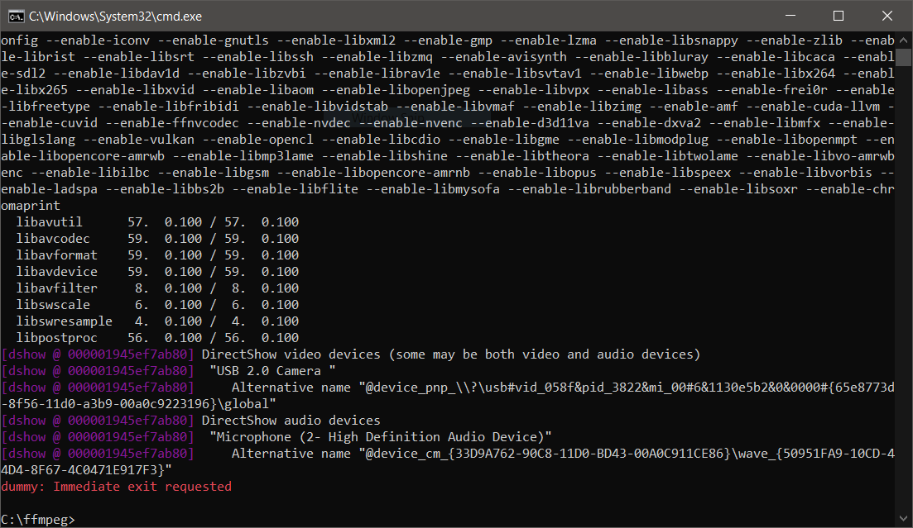

# grabbey
Simple few scripts for screen recording on Windows enviroment using ffmpeg

## The idea
The idea was to create a simple script that not only recorded the desktop but also the webcam, on a Microsoft Windows machine. So it evolved fou a few simple scripts for different situations. So these are simple and opensource for anyone who, i.e. wants to make a tutorial. It basically just uses [ffmpeg](https://ffmpeg.org/) to call the hardware of your machine, and record the different streams. Part of the WebCamz script was inpired by this video: https://youtu.be/O4VqX_Fszx0

## Modes/Scripts
1. WebCamz » Desktop and WebCam - Video and audio
2. Desktopz » Desktop only
3. Desktopaz » Desktop with audio

## Usage
1. Download [ffmpeg](https://ffmpeg.org/) for windows [here](https://www.gyan.dev/ffmpeg/builds/ffmpeg-git-full.7z)
2. On the same folder you have [ffmpeg](https://ffmpeg.org/), type the following command to show all recording "devices"
 
 `> ffmpeg.exe -list_devices true -f dshow -i dummy`
 
 
 
3. Change the variables on the scripts and use it!

## Variables
1. -b:v » video bitrate: in theory the higher, the better quality. But it also depends on video encoding quality
2. -c:v » video codec: video codec used on encoding the video recording; by default h264 is used. If you want hardware acceleration proceed here
3. -crf » a vaue between 18~22 should render a pretty decent video quality
4. -framerate » match this to your screen framerate or use the standard value 30

## Aditional information
To find more aaditional information on ffmpeg desktop recording, please follow: 
1. https://trac.ffmpeg.org/wiki/Capture/Desktop
2. https://trac.ffmpeg.org/wiki/HWAccelIntro
3. 